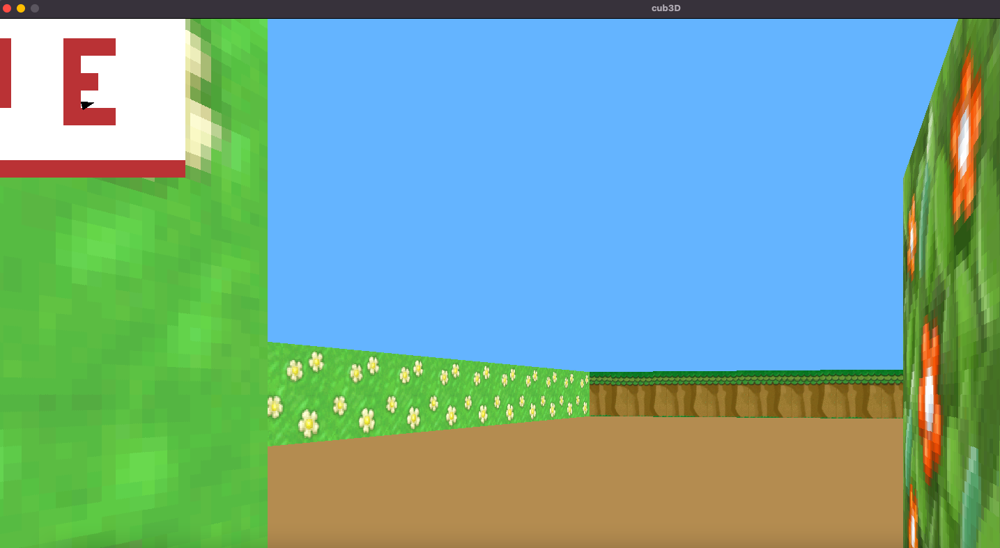
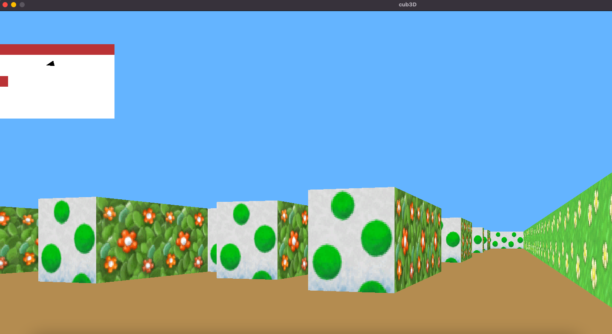

# Cub3D

## My first RayCaster with miniLibX.
This project is inspired by the world-famous Wolfenstein 3D game, which was the first FPS ever. 
It will enable you to explore ray-casting. 
Your goal will be to make a dynamic view inside a maze, in which you’ll have to find your way. 

## Short description of the project

This project’s objectives are similar to all this first year’s objectives: Rigor, use of C, use of basic algorithms, information research etc.  
As a graphic design project, cub3D will enable you to improve your skills in these areas: windows, colors, events, fill shapes, etc.  
To conclude cub3D is a remarkable playground to explore the playful practical applications of mathematics without having to understand the specifics.  
With the help of the numerous documents available on the internet, you will use mathematics as a tool to create elegant and efficient algorithms.  
For the detailed instructions on the project,check the subject.pdf. 

## Our cub3D
### Requirements to run the game
only tested on **macOS Catalina (Version 10.15.7)** 
For all other OS it is not guaranteed to work. 
OpenGL and AppKit is required to run it. 
If you want to run it on Linux [here](https://harm-smits.github.io/42docs/libs/minilibx/getting_started.html#compilation-on-linux) is a tutorial that might help and [here](https://github.com/42Paris/minilibx-linux) is the required version of miniLibX, this is **not tested** with our cub3D. 
### How to cub3D
1. run `make` or `make all` in the root of the directory
2. run `./cub3D map.cub` in the root of the directory
3. move the character with `WASD`
4. turn the FOV left and right by pressing `arrow_left` and `arrow_right` or by moving the mouse right or left

Things to enjoy
- wall collition
- moving hands while walking
- Yoshi WORLD !!

### Map requirements
- decide which texture is displayed on which side
- `0` define walkable spaces
- `1` define walls
- `2` define doors
- the players position is displayed by:
  - `N` player is facing north (top of the 2D map)
  - `E` player is facing east (right side of the 2D map)
  - `S` player is facing south (bottom of the 2D map)
  - `W` player us facing west (left side of the 2D map)
- the map has to be enclosed by walls on all sides
- doors have to have walls on two opposite sides
- any other characters other than the ones above are forbidden
- if there is a ` `(space)&nbsp;inside the map it has to be enclosed by walls, as you can see [here](https://github.com/axelvag/Cub3D/maps/map.cub)
- only one player position is allowed
- you have to set all the textures that should be used as wall texture i.e.
  - `WE imageWE.xpm`
  - `EA imageEA.xpm`
  - `SO imageSO.xpm`
  - `NO imageNO.xpm`
- you have to set the ceiling color, i.e.:
  - `C 0, 183, 183`
- you have to set the floor color, i.e.:
  - `F 141, 1, 126`

### Texture requirements
The wall textures as well as the door texture is interchangeable, as long as: 
- the texture can be 64 by 64 pixels (same width than height) or rectangular
- the texture is a .xpm file
- the textures are called like you want but it's necessary to change the name in the map `image1.xpm`, `image2.xpm`, `image3.xpm`, `image4.xpm`

If you want to change the windowsize, this can be done in the cub3d.h file. 
But the hands are currently not resized to the windowsize, so either you have to resize the texture itself and replace the existing hand-textures in images or just disble the hands by commenting out **line 113** in draw.c. 

